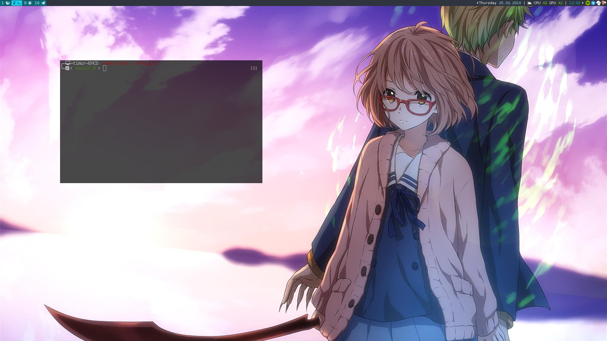

# i3-config-desktop
Features:
* random wallpaper selection
* easily configurable status bar

Requires:
* [twmn](https://github.com/sboli/Twmn)
* [feh](https://github.com/derf/feh)
* [maim](https://github.com/naelstrof/maim)
* [playerctl](https://github.com/acrisci/playerctl)
* [imagemagick](https://github.com/ImageMagick/ImageMagick)
* [compton](https://github.com/chjj/compton)
* [rofi](https://davedavenport.github.io/rofi/)
* i3lock, i3-nagbar

# wallpaper setup
Wallpapers are selected on random from `~/.theme/wallpaper-*.png`. Example:
* wallpaper-0.png
* wallpaper-1.png
* wallpaper-2.png

# status bar setup
Copy `env.example` to `env` if you want to modify the default status configuration. All commands should return a numeric value.
```
CPU_COMMAND='sensors | grep "Physical id 0:" | cut -c18-19'
GPU_COMMAND='nvidia-smi -q -d TEMPERATURE | awk "/GPU Current Temp/ {print $5}"'
```

# start-up programs
Add a list of programs as so into the `env` file.
```
executables=("nm-applet" "firefox" "spotify" "telegram" "owncloud" "redshift-gtk")
```

# screenshots

